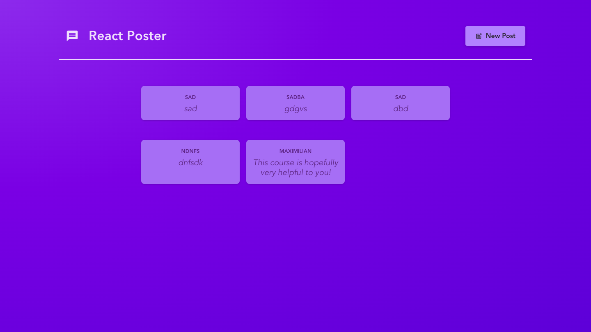
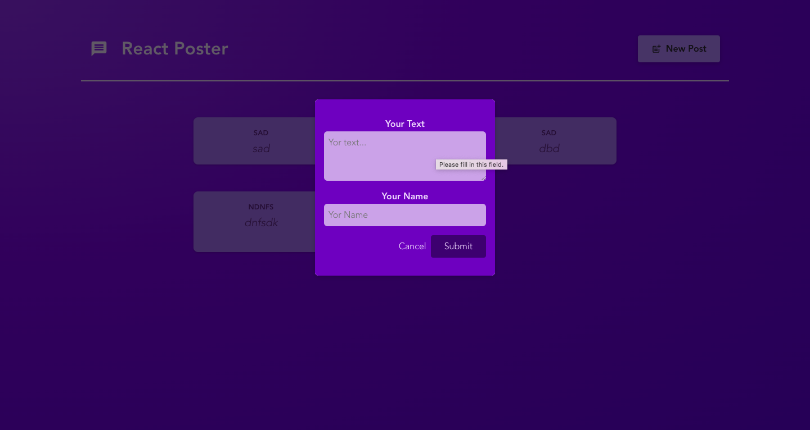

# React Poster




React Poster is a simple web application built with React and React Router. It allows users to create and view posts with a minimalist interface.

## Features

- **Post List:** View a list of all posts.
- **Create New Post:** Submit new posts using a modal form.
- **Dynamic Routing:** Each post has a unique route for detailed viewing.
- **Responsive Design:** Ensures a user-friendly experience across devices.

Clone the repository:

```bash
git clone https://github.com/yourusername/react-poster.git
cd react-poster
```

Install dependencies:

```bash
 npm install
```

Install dependencies:

```bash
 npm start
```

The application will be available at http://localhost:3000.

# API Endpoints

The application interacts with a local backend server:

GET /posts: Fetch all posts.
GET /posts/:id: Fetch a specific post by ID.
POST /posts: Create a new post.

To run the backend, ensure your server is running at http://localhost:8080.

# Usage

Navigate to the home page to view the list of posts.
Click "New Post" to open a modal form for adding a new post.
Submit the form to save the post. The post will be displayed on the main page.

# Dependencies

React
React Router
react-icons
CSS Modules

# Development Notes

The application uses React Router's useLoaderData and action functions for handling data loading and form submissions.
The Modal component includes navigation logic using useNavigate to close the modal on backdrop click.

# License

This project is open-source and available under the MIT License.

<!-- ========================================================================================= -->

# Getting Started with Create React App

This project was bootstrapped with [Create React App](https://github.com/facebook/create-react-app).

## Available Scripts

In the project directory, you can run:

### `npm start`

Runs the app in the development mode.\
Open [http://localhost:3000](http://localhost:3000) to view it in your browser.

The page will reload when you make changes.\
You may also see any lint errors in the console.

### `npm test`

Launches the test runner in the interactive watch mode.\
See the section about [running tests](https://facebook.github.io/create-react-app/docs/running-tests) for more information.

### `npm run build`

Builds the app for production to the `build` folder.\
It correctly bundles React in production mode and optimizes the build for the best performance.

The build is minified and the filenames include the hashes.\
Your app is ready to be deployed!

See the section about [deployment](https://facebook.github.io/create-react-app/docs/deployment) for more information.

### `npm run eject`

**Note: this is a one-way operation. Once you `eject`, you can't go back!**

If you aren't satisfied with the build tool and configuration choices, you can `eject` at any time. This command will remove the single build dependency from your project.

Instead, it will copy all the configuration files and the transitive dependencies (webpack, Babel, ESLint, etc) right into your project so you have full control over them. All of the commands except `eject` will still work, but they will point to the copied scripts so you can tweak them. At this point you're on your own.

You don't have to ever use `eject`. The curated feature set is suitable for small and middle deployments, and you shouldn't feel obligated to use this feature. However we understand that this tool wouldn't be useful if you couldn't customize it when you are ready for it.

## Learn More

You can learn more in the [Create React App documentation](https://facebook.github.io/create-react-app/docs/getting-started).

To learn React, check out the [React documentation](https://reactjs.org/).

### Code Splitting

This section has moved here: [https://facebook.github.io/create-react-app/docs/code-splitting](https://facebook.github.io/create-react-app/docs/code-splitting)

### Analyzing the Bundle Size

This section has moved here: [https://facebook.github.io/create-react-app/docs/analyzing-the-bundle-size](https://facebook.github.io/create-react-app/docs/analyzing-the-bundle-size)

### Making a Progressive Web App

This section has moved here: [https://facebook.github.io/create-react-app/docs/making-a-progressive-web-app](https://facebook.github.io/create-react-app/docs/making-a-progressive-web-app)

### Advanced Configuration

This section has moved here: [https://facebook.github.io/create-react-app/docs/advanced-configuration](https://facebook.github.io/create-react-app/docs/advanced-configuration)

### Deployment

This section has moved here: [https://facebook.github.io/create-react-app/docs/deployment](https://facebook.github.io/create-react-app/docs/deployment)

### `npm run build` fails to minify

This section has moved here: [https://facebook.github.io/create-react-app/docs/troubleshooting#npm-run-build-fails-to-minify](https://facebook.github.io/create-react-app/docs/troubleshooting#npm-run-build-fails-to-minify)
